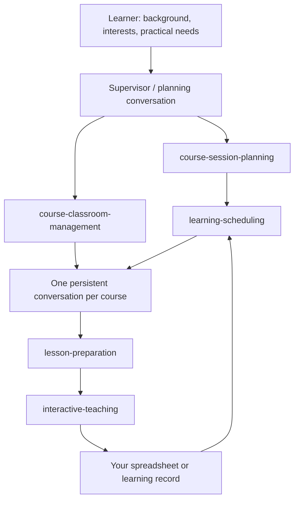

# Codex Personal University

**Five skills for planning courses, preparing lessons, learning through conversation, and recording progress.**

[中文](README.md) | English

I wanted to learn several subjects, but deciding what to learn, in what order, and where each session should stop was fragmented. This project uses one planning conversation and a dedicated classroom conversation for each course, connected by five reusable skills.

It is an open workflow developed from personal learning practice. Course design and learning outcomes need calibration through actual use.

## How it works



“Supervisor + course agents” describes a division of responsibilities: the planning conversation coordinates the curriculum, and each course conversation teaches its subject. Classrooms are persistent, user-accessible conversations. This repository does not include an always-running supervisor service, and temporary subagents are not substitutes for those classrooms.

## The five skills

| Skill | Responsibility | Main output |
| --- | --- | --- |
| [course-session-planning](skills/course-session-planning/SKILL.md) | Derive lesson topics, scope, dependencies, and duration from the learner's needs and content load | A complete session plan; lesson count follows the content |
| [learning-scheduling](skills/learning-scheduling/SKILL.md) | Schedule near-term study using prerequisites, actual progress, and available time | A flexible timetable, optionally mixing subjects |
| [course-classroom-management](skills/course-classroom-management/SKILL.md) | Create, find, and reuse a dedicated conversation for each course | One classroom per course, with a usable handoff and recorded link |
| [lesson-preparation](skills/lesson-preparation/SKILL.md) | Turn a planned lesson into materials ready for teaching | Editable slides, explanations, cases, exercises, answer guidance, and a handout |
| [interactive-teaching](skills/interactive-teaching/SKILL.md) | Teach in segments, respond to actual answers, and preserve a resume point | Interactive learning, progress notes, and authorized record updates |

Course recommendations come from the planning conversation using the background you provide; there is no separate sixth skill. Individual skills can be invoked separately, but installing all five makes the full workflow easier to use.

## Course coverage and depth

Personalization changes the starting point, sequence, examples, and pace; it does not automatically lower core knowledge requirements. For systematic study, use established undergraduate courses and textbooks at an appropriate level as references. Where those are not suitable, use a reliable professional framework. Respect an explicitly requested overview or short course.

- Course planning maps essential content, required depth, and justified tradeoffs before deriving sessions. Explain omissions, reduced depth, and deferred topics; verify where other courses actually cover deferred material.
- Lesson preparation checks whether the necessary explanations, reasoning, relationships, and methods are developed. Recommend merging a thin lesson or turning it into reading, rather than padding slides or repeating exercises.
- Teaching preserves the planned depth. Segment count is not a cap on concepts, and a correct answer to a simple question does not establish deeper understanding. Record material gaps separately from actual learning progress.

Lesson counts, concept counts, and elapsed minutes do not establish quality. Theoretical understanding and analysis are valid outcomes; projects are not mandatory for every subject. These are rules in the skills, not evidence that existing courses are equivalent to university courses or that learning effectiveness has been demonstrated.

## Requirements

- A Codex environment that can read skills. These files provide instructions, not a model, account, or additional permissions.
- Real PPTX generation requires presentation-generation and rendering tools, such as a presentations skill available in the host. That external skill is not distributed here. Without it, a text draft must be identified as a draft.
- Automatic classroom creation requires actual conversation-management tools in the desktop environment. Otherwise, create a conversation manually and paste the course handoff.
- Feishu/Lark synchronization requires your own workbook, an authenticated connector or browser session, and permission to update specific fields. Local progress notes can be used first.

## Installation

Ask Codex:

```text
Use $skill-installer to install the five skill folders under skills/
from https://github.com/gla628/codex-personal-university.
If any skill is already installed, compare it first and preserve my customizations.
```

For manual installation, download this repository and copy the five folders inside `skills/` into the user-level `~/.agents/skills/`, or into `.agents/skills/` in your learning project. Keep each folder's `SKILL.md`, `agents/`, and any required `references/`. Do not copy only the five Markdown files. Compare and back up existing skills before replacing them.

```text
~/.agents/skills/
├── course-session-planning/
├── learning-scheduling/
├── course-classroom-management/
├── lesson-preparation/
└── interactive-teaching/
```

Restart Codex if newly added skills do not appear. See the [official OpenAI skills documentation](https://learn.chatgpt.com/docs/build-skills) for discovery and invocation details. This repository distributes skill folders directly; it is not a marketplace-listed plugin.

## First run

### 1. Explain your learning goal

```text
I want to learn data analysis so I can evaluate the performance of my content.
I can use spreadsheets but have no statistics background. I have about three hours a week.
Help me define the learning goal, then use $course-session-planning to plan every session.
Derive the lesson count from the content rather than targeting a fixed number.
Respond in English.
```

### 2. Schedule sessions and create classrooms

```text
Use $learning-scheduling to plan my next three study sessions within my available time.
Mix subjects where appropriate, respect prerequisites, and leave dates unspecified for now.
```

```text
Use $course-classroom-management to create a dedicated classroom for each selected course.
Keep the same conversation throughout each course. Hand over the plan and materials,
but do not start teaching yet.
```

### 3. Prepare one lesson, then study

In the corresponding classroom:

```text
Use $lesson-preparation to prepare lesson 1 using its planned topic, objectives, scope,
and duration. Include the complete slide deck and exercise explanations.
```

```text
Use $interactive-teaching to start lesson 1. Present and explain the material in segments.
When a question requires my answer, wait for me to respond.
```

To pause or resume, say “Stop here and save my progress” or “Continue from where we left off.”

## Connect your own learning records

This repository contains no personal workbook URLs, classroom IDs, machine-specific material paths, or inherited permission to write to someone else's records.

Use the [personal configuration example](examples/learning-context.example.md) to create `learning-context.local.md` in your own learning directory. Fill in the actual locations and preferences, then provide that file to your planning conversation and classrooms. It is context you supply, not a file that these skills discover automatically in the background.

Suggested logical records, which can be sheets, other spreadsheets, or local files:

| Record | Suggested fields |
| --- | --- |
| Course catalog | Course ID, name, goals, selection status, classroom link |
| Timetable | Date, time, course ID, lesson number, topic, schedule status |
| Lesson details | Course ID + lesson number, objectives, scope, materials, estimated minutes, learning status, actual date, resume notes |
| Skill registry (optional) | Skill name, purpose, invocation example, installation status |

An existing workbook does not need a fixed number of columns. Resolve fields from current headers and identify lessons by course ID plus lesson number, rather than relying on cached row positions.

You can authorize updates once for a specific workbook, course scope, and set of fields. When actual classroom events occur, the teaching skill updates status, real dates, and relevant notes within that authorization. It reports successful synchronization only after writing and reading back the result. “Real time” means event-driven updates during active use, not background polling or offline monitoring.

## Current status and limits

- The workflow has been used for personal course planning, preparing three initial lessons, creating classrooms, and synchronizing lesson-start status. This is not a compatibility guarantee for every environment.
- Prepared materials, completed lessons, and independently demonstrated understanding are different states. Producing slides does not establish learning effectiveness.
- Forty-five minutes and three sessions are adjustable starting assumptions, not universal quotas.
- The operational `SKILL.md` instructions are currently in Chinese. You can request English or another output language; the English teaching experience still needs real-world use.
- Classroom, slide, and spreadsheet operations depend on the host's tools. Models can make factual mistakes; reliable source material and classroom feedback remain necessary.

## Contributing and license

Use Issues to share actual experience: whether time estimates were realistic, the interaction helped, and resumed sessions picked up correctly. Use synthetic or sanitized examples instead of private workbook links, chat history, or credentials.

Developed through personal requirements and collaboration with Codex. Distributed under the [MIT License](LICENSE). You may use, modify, and redistribute these five skills; external tools and referenced materials retain their own licenses.
