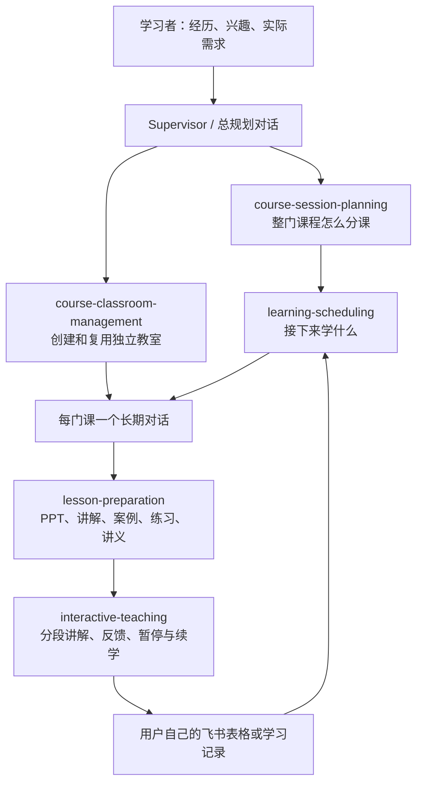

# Codex 个人大学

**用 5 个 Skills，把课程规划、备课、互动学习和进度记录组织起来。**

中文 | [English](README.en.md)

起因很简单：想学的东西不少，但学什么、先学什么、每次学到哪里，容易零散。我尝试在 Codex 中用一个总对话统筹学习，每门课程有自己的独立教室，再用这五个 Skills 连接整个流程。

这是从个人学习实践整理出的开源工作流。课程内容和学习效果需要在实际使用中不断校准。

## 它怎样工作



“Supervisor＋课程 Agent”描述的是对话之间的分工：总对话负责统筹，每门课的独立对话负责教学。这里的教室是可以持续打开的用户对话；本仓库没有后台常驻 Supervisor，也不把临时子 Agent 当作长期教室。

## 五个 Skills

| Skill | 负责什么 | 主要产出 |
| --- | --- | --- |
| [course-session-planning](skills/course-session-planning/SKILL.md) | 根据用途、基础和内容负荷决定每课主题、边界、衔接与时长 | 完整逐课时规划；总课时由内容推导 |
| [learning-scheduling](skills/learning-scheduling/SKILL.md) | 按先修、进度和可用时间，安排近期课程与跨课程混排 | 可调整的课表；不虚构日期或完成状态 |
| [course-classroom-management](skills/course-classroom-management/SKILL.md) | 为每门课创建、查找和复用独立对话，维护教室入口 | 一门课一个教室；可定位的课程交接 |
| [lesson-preparation](skills/lesson-preparation/SKILL.md) | 把一条课次规划做成可以实际使用的材料包 | 可编辑 PPT、讲解、案例、练习解析和讲义 |
| [interactive-teaching](skills/interactive-teaching/SKILL.md) | 使用已有材料分段授课，根据真实回答反馈，保存暂停位置 | 课堂互动、续学记录；授权范围内的进度同步 |

选课由总对话结合你提供的背景完成，不是额外的第六个 Skill。五个 Skills 可以分开调用，但建议一起安装以便衔接。

## 开始之前

- 一个能够读取 Skills 的 Codex 环境。Skills 提供指令，不附带模型、账号或工具权限。
- 要生成真正的 PPT，需要可用的演示文稿生成与渲染能力，例如环境中的 presentations 技能；本仓库不分发该外部技能。缺少能力时只能交付明确标注的文本草案。
- 自动建立独立教室，需要桌面环境实际提供创建、读取和整理对话的工具。没有这些工具时，可以手动新建课程对话并粘贴交接材料。
- 同步飞书需要你自己的表格、有效登录或连接器，以及对具体字段的写入授权。也可以先使用本地学习记录。

## 安装

可对 Codex 说：

```text
使用 $skill-installer，从 https://github.com/gla628/codex-personal-university
安装 skills/ 目录下的这五个 Skills。发现同名技能时先比较，不直接覆盖我的定制。
```

也可以手动安装：下载本仓库，将 `skills/` 内的五个技能文件夹复制到用户级 `~/.agents/skills/`，或学习项目的 `.agents/skills/`。保留每个文件夹内的 `SKILL.md`、`agents/` 和必要的 `references/`；不要只复制五个 Markdown 文件。已有同名技能时先备份和比较。

```text
~/.agents/skills/
├── course-session-planning/
├── learning-scheduling/
├── course-classroom-management/
├── lesson-preparation/
└── interactive-teaching/
```

如果新技能没有出现，重启 Codex 后再检查。安装位置和调用方式参见 [OpenAI 官方 Skills 文档](https://learn.chatgpt.com/docs/build-skills)。本仓库提供直接安装的技能文件夹，不是已上架的插件。

## 第一次使用

### 1. 告诉总对话你的学习目标

```text
我想系统学习数据分析，能判断自己的内容发布效果。
我会用电子表格，但没有统计基础。每周大约有3小时。
先帮我明确课程目标，再用 $course-session-planning 规划每一课。
按内容决定课时，不必凑固定节数。
```

### 2. 排近期课程，并准备教室

```text
使用 $learning-scheduling，按我的时间安排接下来三次学习。
可以跨课程混排，先完成必要先修；暂不指定日期。
```

```text
使用 $course-classroom-management，为已经选定的课程建立独立教室。
每门课从头到尾用同一个对话。先交接规划和材料，不立即开始授课。
```

### 3. 备一课，再开始学习

在对应教室中说：

```text
使用 $lesson-preparation，为第1课备课。
请沿用课程规划的主题、目标、内容边界和时长，准备完整PPT与练习解析。
```

```text
使用 $interactive-teaching，开始第1课。
按段展示材料并讲解；需要我回答时等我作答。
```

暂停或续学时直接说“今天先到这里，保存进度”或“接着上次的位置继续”。

## 连接自己的课程表

本仓库没有个人飞书地址、教室 ID、本机材料路径或预先生效的写入授权。

可参考 [个人配置示例](examples/learning-context.example.md)，在自己的学习目录创建 `learning-context.local.md`，填写实际位置和偏好，然后把这个文件交给总对话和课程教室。该文件用于提供上下文，Skills 不会在后台自动发现或加载它。

建议保留以下逻辑记录，可用飞书 Sheet、其他表格或本地文件实现：

| 记录 | 建议字段 |
| --- | --- |
| 课程总目录 | 课程编号、名称、学习目标、选课状态、教室链接 |
| 课程表 | 日期、时间、课程编号、课次、主题、安排状态 |
| 课时明细 | 课程编号＋课次、目标、内容、材料、预计分钟、学习状态、实际日期、续学笔记 |
| 学习技能（可选） | 技能名称、用途、触发示例、安装状态 |

已有表格不需要为安装技能改成固定列数。写入按实时表头与“课程编号＋课次”定位，避免排序后改错行。

你可以一次性授权：在指定表格的指定课程范围内，随真实课堂开始、暂停和结束更新状态、实际日期和必要笔记。技能仍需实际调用工具并回读成功，才会报告同步完成。这里的“实时”是事件发生时更新，不是离线监控或定时轮询。

## 目前的边界

- 这些工作流已用于个人课程规划、首批三课备课、独立教室和开课状态同步；这不是对所有环境的兼容性保证。
- “已备课”“已学完”和“能够独立应用”是不同状态。生成课件不等于学习效果已经验证。
- 45分钟和三次课只是可以调整的起点，服从课程实际负荷与个人可用时间。
- `SKILL.md` 的工作指令目前以中文编写，可要求模型用英语或其他语言输出；英文教学体验仍需实际试用。
- 教室、PPT 和表格操作取决于宿主工具；模型也可能生成错误内容，需要可靠资料和课堂反馈校正。

## 交流与许可

欢迎通过 Issue 分享实际使用体验，尤其是课时是否合理、课堂互动是否有效、暂停后能否顺利接续。请使用虚构或脱敏示例，不附私人表格链接、聊天历史和凭据。

本仓库由个人需求与 Codex 协作整理，采用 [MIT License](LICENSE)。五个学习 Skills 可自由使用、修改和分发；外部工具与引用资料遵循各自许可。
